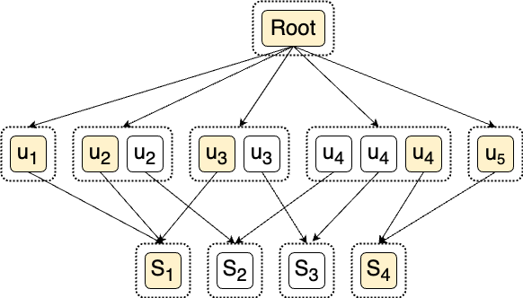

In this quick note, I will show that the E-graph extraction problem is NP-complete.

The E-graph extraction problem is defined as follows:

     Input: An E-graph G and a cost function mapping E-nodes
            to positive numbers.
    Output: A DAG t represented by G such that t has the
            lowest cost possible.

First, the extraction problem is in NP^[Here we consider the optimization variant of the NP complexity class. The decision version of the extract problem is, given an E-graph and a cost function, does there exist a DAG represented by the E-graph with a given cost $n$?] because it can be [reduced](https://arxiv.org/abs/2101.01332) to integer linear programming (ILP).
Moreover, we show the extraction problem is NP-hard by reducing [the minimum set cover problem](https://en.wikipedia.org/wiki/Set_cover_problem) to it.

The minimum set cover problem is defined as follows (adapted from Wikipedia):

     Input: A set of elements {1, 2, ..., n} (called the universe)
            and a collection S of m sets whose union equals the 
            universe.
    Output: The smallest sub-collection of S whose union equals
            the universe. 

We show an instance of how this minimum set cover problem can be reduced to E-graph extraction:
consider the universe $U = \{1, 2, 3, 4, 5\}$ and the collection of sets $S = \{ \{1, 2, 3\}, \{2, 4\}, \{3, 4\}, \{4, 5\} \}$.
The smallest subset of $S$ that covers all of the elements is \{ \{1, 2, 3\}, \{4, 5\} \}.

Our construction is as follows:

1. For each $j\in U$, we create a corresponding E-class $c_{j}$.
2. For each collection $S_i$, we create an E-class $c_{S_i}$ with a singleton E-node $S_i$.
3. For each $S_i=\{j_1, \ldots, j_{l_m}\}$, we create  a new E-node $u_{j_k}(c_{S_i})$ in E-class $c_{j_k}$ for all $j_k$.
4. We create a root E-class with a special E-node whose children include all $C_{j_k}$.
5. Every E-node has a uniform cost of 1.^[In fact, the costs of the root E-node and $u_{j_k}$'s do not matter and can be set as zero, as these E-nodes will be in the extracted DAG anyway. We (arbitrarily) set their cost to be 1 (instead of say 0) to make sure the cost model is strictly monotonic.]

This will produce the following E-graph for our example.

{width=75% .center}

The intuition behind this construction is that, 
 to extract the root E-class, 
 we have to cover all the elements in the universe,
 so we need to pick an E-node from each $c_{j}$.
To cover all $c_{j}$'s with the smallest cost means picking 
 as fewer $S_i$ E-nodes as possible, 
 which corresponds to a minimum set cover.

As a side note, the construction here uses function symbols with non-constant arities (i.e., the root E-node).
This can be fixed by replacing the root E-node with $O(n)$ many E-nodes with binary function symbols forming a depth $O(\log n)$ binary tree,
 so our reduction only requires unary and binary function symbols.

**Update (Aug 29, 2023):** Michael Stepp showed the NP-completeness of this problem via a similar reduction to Min-SAT in [his thesis](https://rosstate.org/publications/eqsat/MikeThesis.pdf).
