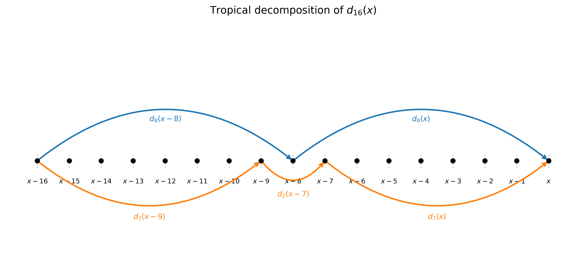
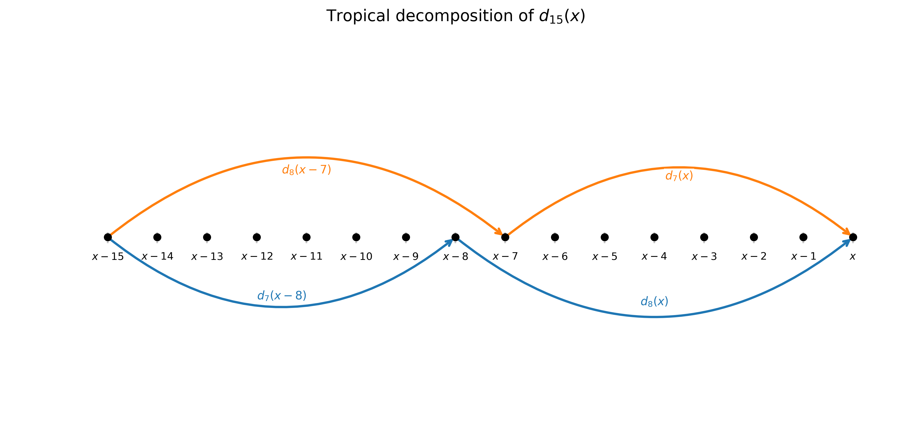
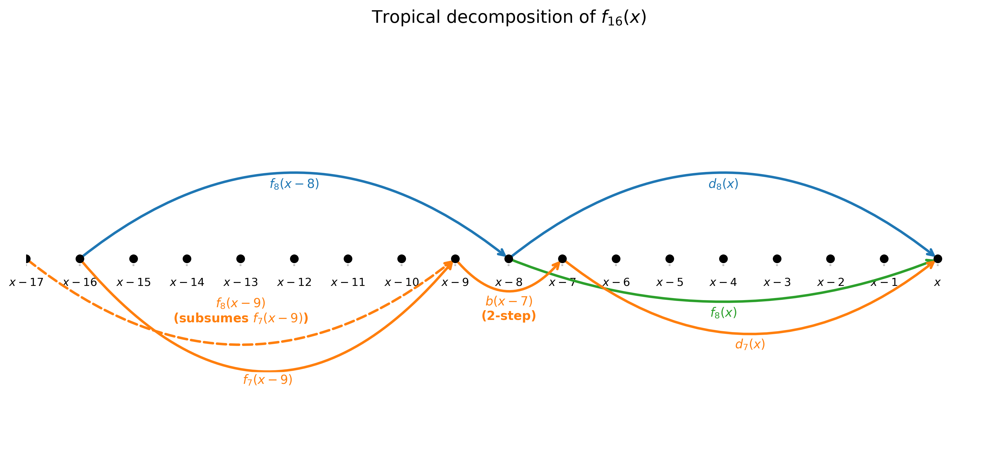
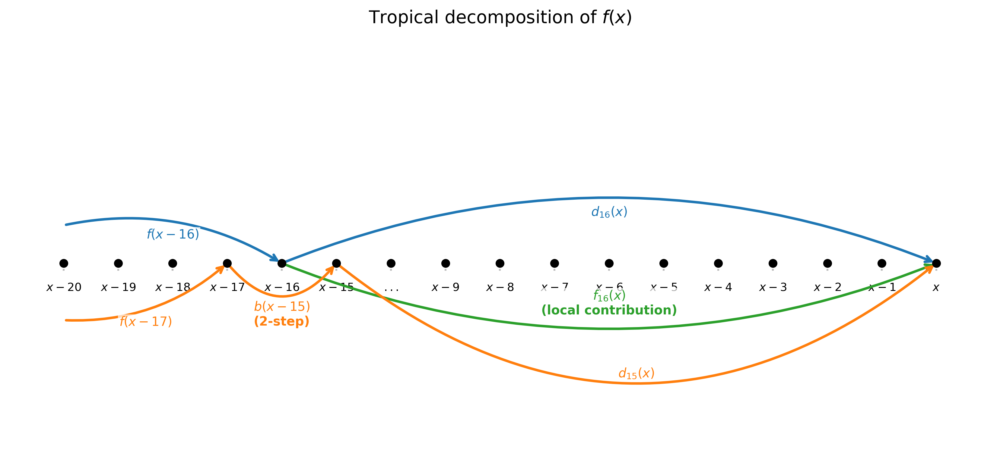

This post is a sequel to [Vectorizing Linear Time-Varying Recurrences](ltv-recurrences.html). That post showed how to break the dependency chain in a second-order LTV recurrence by decomposing it into a logarithmic tower of *propagation weights* $d_k$ and *windowed partial sums* $f_k$, each covering an exponentially growing window. The key was a path model: each position can step forward by 1 (weight $a$) or by 2 (weight $b$), and $d_k(x)$ is the total weight — a polynomial sum — of all paths from $x-k$ to $x$.

Here we apply the same idea to the **tropical semiring**, where multiplication becomes addition and addition becomes $\min$. A second-order time-varying recurrence in tropical algebra looks like this:

$$f(x) = \min\bigl(f(x-1) + a(x),\; f(x-2) + b(x),\; g(x)\bigr)$$

Recurrences of this form arise in shortest-path problems and sequence alignment in bioinformatics, where $g(x)$ is the cost of starting fresh at position $x$, $a$ and $b$ are gap-extension costs, and $f(x)$ is the minimum-cost solution ending at $x$.

The path model carries over directly. $d_k(x)$ is now the **minimum total weight** of any path from $x-k$ to $x$, where a 1-step from $y-1$ to $y$ costs $a(y)$ and a 2-step from $y-2$ to $y$ costs $b(y)$. For instance, $d_{16}(x)$ is the cheapest way to travel from $x-16$ to $x$ by combining 1-steps and 2-steps. Similarly, $f_k(x)$ is the value $f(x)$ would take if all positions before $x-k+1$ had $g = +\infty$ (the tropical zero) — so $f_{16}(x)$ is the best solution reachable entirely from sources within the local window $[x-15, x]$.

The decomposition strategy carries over with surprisingly little change. Two structural simplifications emerge from the tropical setting, making the algorithm indeed slighly better than the arithmetic case in the last post.

# The Propagation Weights $d_k$

## Even Windows

For even window sizes, the formula is structurally identical to the standard arithmetic case, with $\times$ replaced by $+$ and $+$ replaced by $\min$. To compute $d_{16}(x)$ — the minimum-weight path from $x-16$ to $x$ — we split at the midpoint $x-8$:

1. **Paths through $x-8$**: travel from $x-16$ to $x-8$ (weight $d_8(x-8)$), then from $x-8$ to $x$ (weight $d_8(x)$).

2. **Paths that 2-step over $x-8$**: arrive at $x-9$, 2-step to $x-7$ (weight $d_2(x-7)$), then continue to $x$ (weight $d_7(x)$).

$$d_{16}(x) = \min\bigl(d_8(x) + d_8(x-8),\; d_7(x) + d_2(x-7) + d_7(x-9)\bigr)$$

This is exactly the standard arithmetic formula translated term-by-term into the tropical semiring: $\times$ becomes $+$ and $+$ becomes $\min$. The same two-case split — paths through the midpoint versus paths that 2-step over it — is exhaustive in both algebras. Nothing new here.

## Odd Windows: Idempotency Replaces Inclusion-Exclusion

In standard arithmetic, computing $d_{15}(x)$ — paths from $x-15$ to $x$ — required three terms: count paths through $x-8$, count paths through $x-7$, then subtract the overlap (paths through both, which make a 1-step from $x-8$ to $x-7$). The subtraction was necessary because those paths were counted twice and arithmetic inflates with repetition.

In tropical algebra, **there is nothing to subtract**. Consider any path from $x-15$ to $x$. It must visit at least one of $x-8$ or $x-7$: a 2-step can skip at most one of two adjacent positions, so no single step can leap over both simultaneously. This gives us two overlapping cases:

- **Split at $x-8$**: paths from $x-15$ to $x-8$ (weight $d_7(x-8)$), then from $x-8$ to $x$ (weight $d_8(x)$).
- **Split at $x-7$**: paths from $x-15$ to $x-7$ (weight $d_8(x-7)$), then from $x-7$ to $x$ (weight $d_7(x)$).

$$d_{15}(x) = \min\bigl(d_8(x) + d_7(x-8),\; d_7(x) + d_8(x-7)\bigr)$$

This is correct even though paths through *both* $x-8$ and $x-7$ appear in both terms, because $\min$ is **idempotent**: $\min(v, v) = v$. Any path counted in both splits contributes its weight $v$ to both branches, and $\min(v, v) = v$ recovers the correct answer. Double-counting under $\min$ is automatically harmless.

The full tower of odd-window formulas:

$$d_7(x) = \min\bigl(d_4(x) + d_3(x-4),\; d_3(x) + d_4(x-3)\bigr)$$

$$d_3(x) = \min\bigl(d_2(x) + a(x-2),\; a(x) + d_2(x-1)\bigr)$$

In each case, the two splits cover all paths because the maximum step size is 2, and two adjacent positions cannot both be skipped by a single jump.

# The Windowed Partial Sums $f_k$

Similarly, define $f_k(x)$ as:
$$f_k(x) = \min_{y \in [x-k+1,\, x]} \bigl(g(y) + d_{x-y}(x)\bigr)$$
the cheapest way to start a new path at some position $y$ within the local window $[x-k+1, x]$ and reach $x$.

## Even Windows

For even window sizes, we split the window $[x-2k+1, x]$ at the midpoint $x-k$. The contributions from the right half $[x-k+1, x]$ are $f_k(x)$. For the left half $[x-2k+1, x-k]$, a path to $x$ either passes through $x-k$ or 2-steps over it from $x-k-1$ to $x-k+1$:

$$f_{16}(x) = \min\bigl(f_8(x),\; d_8(x) + f_8(x-8),\; d_7(x) + b(x-7) + f_7(x-9)\bigr)$$

Reading left to right: $f_8(x)$ captures the right-half contribution; $d_8(x) + f_8(x-8)$ propagates the left-half contribution forward through paths visiting $x-8$; and $d_7(x) + b(x-7) + f_7(x-9)$ propagates through paths that 2-step over $x-8$, bridging from $x-9$ to $x-7$ with the 2-step cost $b(x-7)$, then continuing to $x$.

## Odd Windows: Not Needed

In standard arithmetic, we needed both $f_{2k}$ and $f_{2k-1}$ at every layer. The stitching formula used $f_{15}$ as the windowed partial sum for the 2-step-over-boundary term, because contributions from the left had to be accounted for *exactly*: any slippage would inflate the sum.

In tropical algebra, **no odd-window $f$ arrays are needed at any layer**. The key observation is that in the formula for $f_{16}$, the third term uses $f_7(x-9)$ — a window of size 7 covering exactly $[x-15, x-9]$. In tropical, we can replace it with $f_8(x-9)$, which covers the wider window $[x-16, x-9]$:

$$f_{16}(x) = \min\bigl(f_8(x),\; d_8(x) + f_8(x-8),\; d_7(x) + b(x-7) + f_8(x-9)\bigr)$$

Why is this valid? Because $f_8(x-9) \leq f_7(x-9)$: by including one extra starting position ($y = x-16$), we take a minimum over a *superset* of paths, so the value can only stay the same or decrease. $f_8$ *subsumes* $f_7$ — it is always at least as good. Any contribution from $y = x-16$ that $f_8$ picks up is also captured by the stitching term $d_{16}(x) + f(x-16)$; idempotency ensures the double coverage is harmless.

By the same argument, at every layer of the tower wherever $f_{2k-1}$ would appear, $f_{2k}$ serves equally well. No odd-window $f$ array is ever required.

# Building the Tower and Stitching Together

The computation proceeds in a logarithmic tower. Starting from $d_1(x) = a(x)$, $d_2(x) = \min(b(x), a(x) + a(x-1))$, and $f_2(x) = \min(g(x), g(x-1) + a(x))$, each layer computes three arrays — $d_{2k}$, $d_{2k-1}$, and $f_{2k}$ — from the previous layer's $d_k$, $d_{k-1}$, and $f_k$, in $O(1)$ operations per element. After $\log_2 k$ layers, the final stitching resolves the recurrence:

$$f(x) = \min\bigl(f_{16}(x),\; d_{16}(x) + f(x-16),\; d_{15}(x) + b(x-15) + f(x-17)\bigr)$$

The three terms are: the local window contribution $f_{16}(x)$; the accumulated history at $x-16$ propagated forward through $d_{16}$; and the history at $x-17$ propagated via a 2-step of cost $b(x-15)$ to $x-15$, then forward with $d_{15}$. This is the same as the arithmetic case in the previous post, only with a different algebra.

# Work Analysis

In standard arithmetic, each layer of the tower maintained **4 arrays**: $d_{2k}$, $d_{2k-1}$, $f_{2k}$, and $f_{2k-1}$. The work multiplier was roughly $1 + 4 \cdot \log k$ per output element, which for $k = 16$ gives $1 + 4 \cdot 4 - 3 = 14$, where the $-3$ accounts for the free base cases $d_1 = a$ and $f_1 = g$, and the unneeded $f_{15}$ at the final layer.

In the tropical case, each layer maintains only **3 arrays**: $d_{2k}$, $d_{2k-1}$, and $f_{2k}$. The odd-window $f_{2k-1}$ is eliminated at every layer, not just the last. The work multiplier is roughly $1 + 3 \cdot \log k$, which for $k = 16$ gives:

$$1 + 3 \cdot 4 - 1 = 12$$

where the $-1$ accounts for the free base case $d_1 = a$. The full array count for $k = 16$:

| Layer | Arrays | Count |
|-------|--------|-------|
| Base | $d_2$, $f_2$ | 2 |
| 1 | $d_4$, $d_3$, $f_4$ | 3 |
| 2 | $d_8$, $d_7$, $f_8$ | 3 |
| 3 | $d_{16}$, $d_{15}$, $f_{16}$ | 3 |
| Stitching | $f$ | 1 |

**Total: 12 array operations per output element**, compared to 14 for standard arithmetic. The saving of 2 comes from eliminating $f_3$ and $f_7$ (the odd-window $f$ arrays at layers 1 and 2). At the final layer, standard arithmetic also omits $f_{15}$, so there is no additional saving there.

Why does idempotency produce exactly this reduction? In standard arithmetic, $f_{2k-1}$ was needed because substituting $f_{2k}$ would include contributions from starting positions outside the intended window, inflating the sum. In tropical, $f_{2k}$ takes the minimum over a *superset* of those positions, so $f_{2k}(x) \leq f_{2k-1}(x)$: using it is always at least as good. Any extra contributions it picks up from outside the intended window are also covered by adjacent terms in the formula, and idempotency absorbs the overlap — $\min(v, v) = v$ costs nothing.

The practical conclusion mirrors the standard arithmetic case: for 32-bit floats on AVX-512 with $k = 16$ lanes, the $12\times$ overhead makes vectorization marginal. But for narrower types like `int16` or `int8`, where a 512-bit register holds 32 or 64 lanes respectively, the per-lane overhead becomes proportionally smaller and the benefit grows.

# Closing Thoughts

Unlike the standard arithmetic algebra, tropical algebra does not have subtraction nor inclusion-exclusion; instead, it enjoys idempotence of the addition operation: $\min(v, v) = v$ eliminates two separate complications: we don't need inclusion-exclusion for odd-window $d_k$, and we can eliminate all odd-window $f_{2k-1}$ arrays by using a subsuming $f_{2k}$.

One could view the standard arithmetic algorithm as the "careful" version that tracks contributions exactly to avoid double-counting, and the tropical algorithm as the "lax" version that permits double-counting because the algebra renders it harmless. The lax version is simpler and, in this case, also more efficient.

As with the standard arithmetic case, this saving can also be extended to higher-order tropical recurrences.
