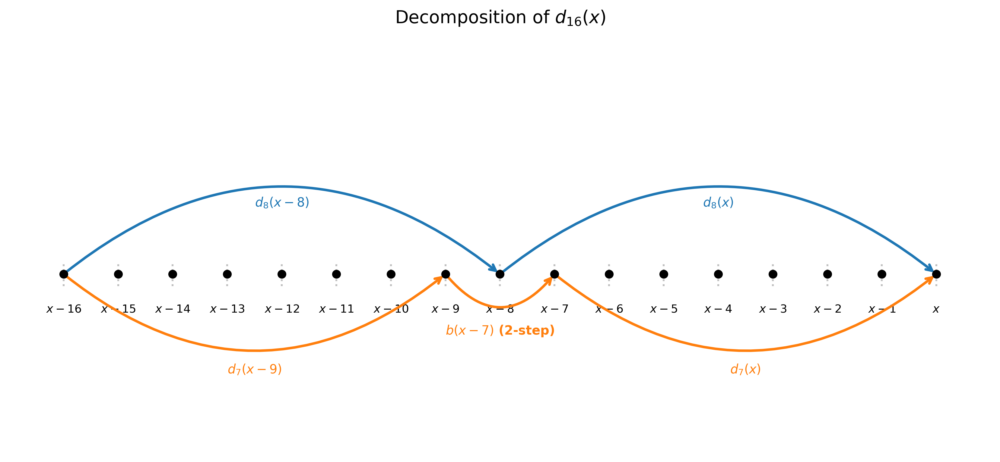
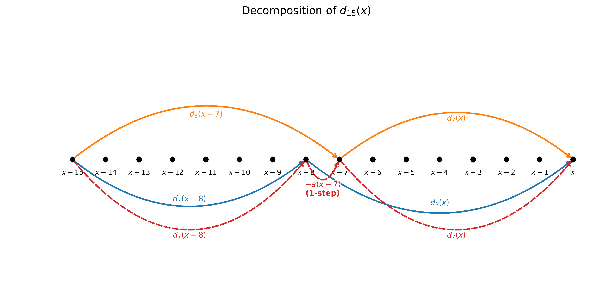
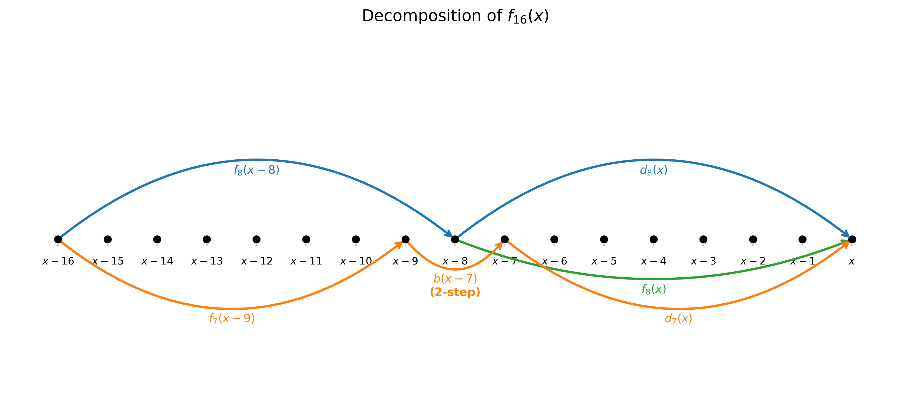
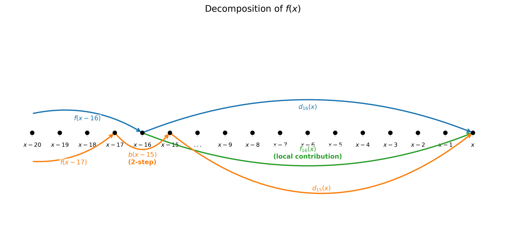

Many image processing operations reduce to evaluating a **linear time-varying (LTV) recurrence**. For example, below is a second-order LTV recurrence:

$$f(x) = a(x)\,f(x-1) + b(x)\,f(x-2) + g(x)$$

where $a$, $b$, and $g$ are coefficient arrays (provided or computed on-the-fly) that vary with position. A linear time-varying recurrences is the most general form of linear recurrences, and many IIR filters are instances of it. To compute it naively is straightforward, to maximize single-core performance requires us to process multiple pixels simultaneously, with SIMD instruction sets like AVX-512. On the other hand, this recurrence has a sequential dependency chain on its previous values. You cannot start computing $f(x)$ until you have $f(x-1)$ and $f(x-2)$.

This post describes a new algorithm that breaks the dependency chain and vectorizes LTV recurrences with better practical constants than existing approaches, making the vectorization actually worthwhile.

# The Classical Approach: Matrix Prefix Scans

The standard technique for parallelizing recurrences goes back at least to Karp, Miller, and Winograd (1967), later popularized by Blelloch as a general parallel primitive. The idea is to lift the scalar recurrence into matrix form. Observe that the update can be written as:

$$\begin{pmatrix} f(x) \\ f(x-1) \\ 1 \end{pmatrix} = \underbrace{\begin{pmatrix} a(x) & b(x) & g(x) \\ 1 & 0 & 0 \\ 0 & 0 & 1 \end{pmatrix}}_{M(x)} \begin{pmatrix} f(x-1) \\ f(x-2) \\ 1 \end{pmatrix}$$

So computing all values $f(0), f(1), \ldots, f(n-1)$ is equivalent to computing the prefix products $M(x) \cdot M(x-1) \cdots M(0)$ for each $x$. Prefix products can be computed in $O(\log n)$ depth and $O(n \log n)$ work via a divide-and-conquer up-sweep and down-sweep, which is parallelizable across $k$ SIMD lanes.

The key structural observation is that the last row of every $M(x)$ is always $(0, 0, 1)$, and this is preserved under matrix multiplication. So rather than tracking all 9 entries of a $3\times 3$ matrix through the prefix scan, we only need to track the first two rows — 6 values per position. Each combine step costs 2 multiplications per tracked value, for a total of 12 multiplications per step, and there are $1 + \log_2 k$ steps to vectorize $k$ lanes.

The work multiplier compared to scalar evaluation is roughly $\mathbf{6 \cdot (1 + \log k)}$ per output element. For $k = 16$ (AVX-512), this works out to about $6 \cdot 5 = 30$ times the scalar work — a significant overhead just to exploit the parallelism. Whether this is worth it depends on the problem, but a $30\times$ overhead for $16\times$ throughput is a pretty poor trade, especially when memory bandwidth and instruction decode are already bottlenecks in image processing pipelines.

# A Better Decomposition

The bottleneck in the matrix scan is that each combine step needs to track 6 values (the two nontrivial rows of the matrix). What if we could reduce that to 4?

The key insight is that the matrix $M(x)$ has more structure than just its bottom row. We can exploit the *sparsity of the recurrence* — the fact that only two previous values appear ($f(x-1)$ and $f(x-2)$) — to decompose the computation differently.

Instead of maintaining full matrix prefix products, we maintain two families of precomputed arrays across a **logarithmic tower of layers**, where each layer covers a window of twice the size of the previous one. At each layer, exactly **4 arrays** suffice: two **propagation weights** $d_k$ and $d_{k-1}$, and two **windowed partial sums** $f_k$ and $f_{k-1}$. Let me explain each family.

## The Propagation Weights $d_k$

Define $d_k(x)$ as the total weighted contribution of $f(x-k)$ to $f(x)$, summing over all valid **paths** from position $x-k$ to position $x$. A path is a sequence of steps that can either advance by 1 (incurring the local weight $a$) or advance by 2 (incurring the local weight $b$). Concretely:

- A 1-step from $y-1$ to $y$ contributes a factor of $a(y)$.
- A 2-step from $y-2$ to $y$ contributes a factor of $b(y)$.

For instance, $d_1(x) = a(x)$ (the only path from $x-1$ to $x$ is a single 1-step), and $d_2(x) = b(x) + a(x)\,a(x-1)$ (either a direct 2-step, or two 1-steps). The value $d_k(x)$ is a kind of transfer function — it tells you how much $f(x-k)$ propagates into $f(x)$ through the recurrence, summed over all routing choices.

### Building $d_k$ inductively for even $k$

The construction is recursive. To compute $d_{2k}(x)$ (paths from $x-2k$ to $x$), we split at the midpoint $x-k$ and consider two mutually exclusive cases:

1. **Paths that pass through $x-k$**: These contribute $d_k(x-k) \cdot d_k(x)$ — first travel from $x-2k$ to $x-k$ (weight $d_k(x-k)$), then from $x-k$ to $x$ (weight $d_k(x)$).

2. **Paths that 2-step over $x-k$**: These land at $x-k+1$ after arriving at $x-k-1$, skipping the midpoint. They contribute $d_{k-1}(x-k-1) \cdot b(x-k+1) \cdot d_{k-1}(x)$ — travel from $x-2k$ to $x-k-1$, then 2-step to $x-k+1$ (weight $b(x-k+1)$), then continue to $x$.

These two sets of paths are genuinely disjoint: any path either visits $x-k$ or skips over it. So we get the exact formula:

$$d_{2k}(x) = d_k(x) \cdot d_k(x-k) + d_{k-1}(x) \cdot b(x-k+1) \cdot d_{k-1}(x-k-1)$$

For example, at window size 16 (i.e., $k=8$):

$$d_{16}(x) = d_8(x) \cdot d_8(x-8) + d_7(x) \cdot b(x-7) \cdot d_7(x-9)$$

### Building $d_k$ for odd $k$: inclusion-exclusion

For odd $k = 2m+1$, we cannot split cleanly at a single midpoint because $k$ is not divisible by 2. Instead, we consider two *overlapping* splits — at $x-m$ and $x-m-1$ — and correct for double-counting via inclusion-exclusion.

- **Split A** (at $x-m$): paths from $x-k$ to $x-m$, then from $x-m$ to $x$. Contributes $d_{m+1}(x) \cdot d_m(x-m-1)$.
- **Split B** (at $x-m-1$): paths from $x-k$ to $x-m-1$, then from $x-m-1$ to $x$. Contributes $d_m(x) \cdot d_{m+1}(x-m)$.

The two splits overlap on paths that pass through *both* $x-m-1$ and $x-m$. These are paths that make a 1-step from $x-m-1$ to $x-m$, with weight $a(x-m)$. Subtracting the overlap:

$$d_{2m+1}(x) = d_{m+1}(x) \cdot d_m(x-m-1) + d_m(x) \cdot d_{m+1}(x-m) - d_m(x) \cdot a(x-m) \cdot d_m(x-m-1)$$

For example, at window size 15 (i.e., $m=3$):

$$d_{15}(x) = d_8(x) \cdot d_7(x-8) + d_7(x) \cdot d_8(x-7) - d_7(x) \cdot a(x-7) \cdot d_7(x-8)$$

This three-term formula has a geometric reading: count paths through the left boundary, count paths through the right boundary, subtract those counted by both. The subtracted paths are precisely the ones that 1-step across the boundary, which the recurrence weights by $a$.

## The Windowed Partial Sums $f_k$

The arrays $f_k(x)$ play a complementary role. Define $f_k(x)$ as the value $f$ would take at position $x$ if all positions strictly before $x-k$ were set to zero — in other words, the contribution from $g$-values and from the boundary conditions *within* the local window $[x-k, x]$.

These satisfy a recurrence structurally identical to the $d_k$ formulas. For even window size $2k$:

$$f_{2k}(x) = f_k(x) + d_k(x) \cdot f_k(x-k) + d_{k-1}(x) \cdot b(x-k+1) \cdot f_{k-1}(x-k-1)$$

Reading right to left: $f_k(x)$ captures the right-half contribution; $d_k(x) \cdot f_k(x-k)$ is the left-half contribution propagated forward through paths crossing the midpoint; and $d_{k-1}(x) \cdot b(x-k+1) \cdot f_{k-1}(x-k-1)$ is the left-half contribution propagated through paths that 2-step over the midpoint. 

The odd window size formula is analogous, with a similar inclusion-exclusion structure as $d_{2m+1}$.

## Building the Tower and Stitching Together

The computation proceeds in a logarithmic tower of layers. Starting from the base cases $d_1(x) = a(x)$, $d_0(x) = 1$, $f_1(x) = g(x)$, and $f_0(x) = 0$, each layer doubles the window size, computing $d_{2k}$, $d_{2k-1}$, $f_{2k}$, and $f_{2k-1}$ from $d_k$, $d_{k-1}$, $f_k$, and $f_{k-1}$ of the previous layer. After $\log_2 k$ layers, we have window-16 arrays in hand.

The final pass resolves the full recurrence by stitching windows together:

$$f(x) = f_{16}(x) + d_{16}(x) \cdot f(x-16) + d_{15}(x) \cdot b(x-15) \cdot f(x-17)$$

The three terms are exactly analogous to the base recurrence itself: $f_{16}(x)$ is the self-contained contribution of the current window, $d_{16}(x) \cdot f(x-16)$ propagates the accumulated history through paths that visit $x-16$, and $d_{15}(x) \cdot b(x-15) \cdot f(x-17)$ propagates history through paths that 2-step over $x-16$ (landing at $x-15$ from $x-17$ with weight $b(x-15)$, then traveling the remaining 15 positions with weight $d_{15}(x)$).

For readers familiar with the matrix prefix scan formulation: the coefficient $d_{15}(x) \cdot b(x-15)$ is exactly the $(0,1)$ entry of the combined matrix — the one capturing the indirect influence of $f(x-17)$ via a 2-step over the boundary (otherwise the matrix multiplication form will double count). The local window decomposition recovers this matrix structure implicitly, without ever forming full matrix products.

## Work Analysis

At each layer of the tower, we compute exactly 4 arrays ($d_{2k}$, $d_{2k-1}$, $f_{2k}$, $f_{2k-1}$), each requiring a constant number of operations per element. The tower has $1 + \log_2 k$ layers. So the work multiplier compared to scalar evaluation is roughly $\mathbf{4 \cdot (1 + \log k)}$ per output element.

For $k = 16$, this gives $4 \cdot 5 = 20$, which is better than the matrix scan's $6 \cdot 5 = 30$. The asymptotic depth remains $O(\log n)$ and the total work remains $O(n \log n)$.
This suggests this algorithm is still probably not more efficient than the serial implementation for 32 bits datatypes, but likely worth it for datatypes like `int8` or `int16`. 

# Extension to Third-Order Recurrences

We also briefly describe how the algorithm extends to higher-order recurrences. For a third-order LTV recurrence

$$f(x) = a(x)\,f(x-1) + b(x)\,f(x-2) + c(x)\,f(x-3) + g(x),$$

the path model extends by adding 3-steps (with weight $c$). The even-split formula for $d_{2k}$ gains two new terms capturing paths that 3-step over the midpoint:

$$d_{16}(x) = d_8(x)\,d_8(x-8) + d_7(x)\,b(x-7)\,d_7(x-9) + d_7(x)\,c(x-7)\,d_6(x-10) + d_6(x)\,c(x-6)\,d_7(x-9)$$

The first two terms handle the 1-step crossing through $x-8$ and the 2-step crossing over it; the third and fourth terms are new, handling 3-step crossings: one departs from $x-10$ and lands at $x-7$ (weight $c(x-7)$), and the other departs from $x-9$ and lands at $x-6$ (weight $c(x-6)$).

The odd-split formula looks as follows:

$$d_{15}(x) = d_8(x)\,d_7(x-8) + d_7(x)\,d_8(x-7) - d_7(x)\,a(x-7)\,d_7(x-8) + d_6(x)\,c(x-6)\,d_6(x-7)$$

The four terms correspond to four cases: paths that pass through $x-7$ but not $x-8$, paths that pass through $x-8$ but not $x-7$, paths that pass through both (the overlap), and paths that pass through neither and instead do 3-step at $x-6$ (the new case).

In the second-order case, a 2-step can skip at most one of the two adjacent positions, so two-term inclusion-exclusion sufficed; with 3-steps available, a single jump can skip both, which correspond to the new case above.

Complexity-wise, each layer of the tower now requires 3 $d$-arrays ($d_k$, $d_{k-1}$, $d_{k-2}$) and 3 $f$-arrays — 6 arrays total per layer, versus 4 for the second-order case.

The general pattern seems to be $2p$ arrays per layer for a $p$-th order recurrence. This matches the intuition: a $p$-th order recurrence allows $p$ ways to cross any boundary (1-step, 2-step, ..., $p$-step), and each introduces an independent $d_{k-1}, d_{k-2}, \ldots$ interaction. The inclusion-exclusion correction for odd windows generalizes correspondingly, though the precise formula for $p > 2$ is left as future work.

Compared to the matrix prefix scan, where a $p$-th order recurrence requires a $(p+1)\times(p+1)$ matrix with $p(p+1)$ nontrivial entries, the local window decomposition's $2p$ arrays per layer scales much more favorably. For $p = 2$, the matrix approach needs 6 entries versus our 4 arrays; for $p = 3$, the comparison is 12 versus 6.

# Closing Thoughts

This algorithm replaces the sequential dependency chain with a parallel tower-building phase while tracking fewer arrays per layer than a matrix prefix scan. One helpful intuition for this improvement is that the matrix form of the recurrence is sparse, and the six non-constant entries compute overlapping information.

As for future work, I have not formalized the general recipe for order-$p$ recurrences and, on the experimental side, I have not measured the actual performance of this improvement and the original matrix scan and understood the trade-offs in practice.
