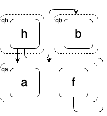

Term rewriting is one of the most fundamental techniques in programming languages. 
It is used to define program semantics, to optimize programs, and to check program equivalences.
An issue with using term rewriting to optimize program is that, it is usually not clear 
 which rule should be applied first, among all the possible rules.
Equality saturation (EqSat) is a variant of term rewriting that mitigates this so-called Phase-Ordering Problem.
In EqSat, all the rules are applied at the same time,
 and the resulting program space is stored compactly in a data structure called E-graph^[
  The reader should treat E-graphs and tree automata as two interchangeable terms.
  An E-graph is just a deterministic finite tree automaton
  with no $\epsilon$ transitions and no unreachable states.
  The only place the difference matters is in describing tree automata completion,
  where we need $\epsilon$-transitions to denote the preorder relation between E-nodes/states.
].

EqSat has been shown to be very successful for program optimizations and program equivalence checking,
 even when the given set of rewrite rules are not terminating or even when the theory is not decidable in general.
However, despite its success in practice, there are no formal guarantees about EqSat:
 for example, when does EqSat terminate, and if it does not, how does one make it terminate.
The first problem is known in the term rewriting literature as the termination problem, 
 and the second is known as the completion problem.
Both problems are very hard, and there are a ton of literatures on both problems.
In the setting of EqSat, 
 these problems are not only theoretically interesting,
 both also have practical implications.
For example, in program optimization,
 we may want to get the most "optimized" term with regard to a given set of rules,
 so making sure EqSat terminate is important to such optimality guarantees.
Or, you may know some theory is decidable but deciding it is slow,
 so you want to speed up the reasoning by using EqSat,
 but there is no point in "speeding up" EqSat if it simply does not terminate.
In this post, we will focus on the termination problem of EqSat.
As it turns out,
 there are many interesting, and even surprising, results, about the termination problem with EqSat.

This post will show (1) how the innocent-looking associativity rule can cause non-termination,
 (2) why a terminating, and even canonical, term rewriting system does not necessarily terminate in EqSat,
 (3) how to fix the above problem by "weakening" EqSat's merge operation, 
 and (4) two potentially promising approaches to ensure the termination of EqSat.
One fascinating thing I found during this journey is that,
  researchers working on tree automata indeed developed a technique almost identical to EqSat,
  known as Tree Automata (TA) completion.
Different from EqSat, TA Completion does not have the problem in (2) and is exactly the algorithm we will show in (3).
Moreover, there is a beautiful connection between EqSat and TA completion.

# Term rewriting 101: Ground theories are decidable via congruence closure

Before understanding why associativity can cause non-termination,
 let us first briefly review some relevant backgrounds on ground theories and congruence closure.

A ground equational theory is an equational theory induced by a finite set of ground identities of the form $s\approx t$,
 where both $s$ and $t$ are ground terms (i.e., no variables).
For example, below is an example of a ground theory over signature $\Sigma={a,b,c,f,g}$:
\begin{align*}
  a&\approx f(b)\\
  b&\approx g(c)\\
  f(g(c))&\approx f(a)\\
\end{align*}
All the equations that can be implied by the three identities are true in this equational theory.
For example, we have $a\approx f(b)\approx f(g(c))\approx f(a)$. 
Here, $f(b)\approx f(g(c))$ holds 
 because we have $b\approx g(c)$.
In equational theory, 
 a function by definition maps equivalent inputs to equivalent outputs.

A classical result in term rewriting and logic is that
 the word problem of ground equational theory is decidable.
A (ground) word problem asks whether two ground terms $s$ and $t$ are equivalent in a given theory.
In general, this problem is undecidable.
However, if the theory is ground, 
 several algorithms exist that decide its word problem.
The most famous one is probably the $O(n \log n)$ congruence closure algorithm of Downey, Sethi, and Tarjan.
One way to view the congruence closure algorithm is that
 it produces a canonical term rewriting system 
 for each input set of ground identities:
For each input theory $E$, 
 it builds the corresponding E-graph,
 and every E-graph corresponds to a canonical term rewriting system.
For example, the congruence closure algorithm will produce the following E-graph for the theory above:
\begin{align*}
c_a&=\{a, f(c_a), f(c_b)\}\\
c_b&=\{b, g(c_c)\}\\
c_c&=\{c\}
\end{align*}
where $c_a, c_b, c_c$ denote E-classes of the E-graph, and $a,b,c,f(c_a), f(c_b), g(c_c)$ denote E-nodes.
This E-graph naturally gives the following canonical term rewriting system $G$, which rewrite terms to the e-classes they are in from bottom to top:
\begin{align*}
a&\rightarrow_G c_a\\
f(c_a)&\rightarrow_G c_a\\
f(c_b)&\rightarrow_G c_a\\
b&\rightarrow_G c_b\\
g(c_c)&\rightarrow_G c_b\\
c&\rightarrow_G c_c\\
\end{align*}
Now, checking $s\approx t$ 
 can be simply done by checking if there exists some normal form $u$ such that
 $s\rightarrow^*_G u \leftarrow^*_Gt$ holds. For example, $g(f(a))\approx g(f(g(c)))$ because
\begin{align*}
g(f(a))&\rightarrow_Gg(f(c_a))\\
&\rightarrow_Gg(c_a)\\
&\leftarrow_G g(f(c_b)) \\
&\leftarrow_Gg(f(g(c_c))\\
&\leftarrow_Gg(f(g(c))))
\end{align*}

This is sound and always terminates, because the term rewriting system produced by an E-graph is canonical--meaning every term will have exactly one normal form and term rewriting always terminates.

# Ground associative theory does not terminate in EqSat

Associativity is the fundamental law to many algebraic structures like semigroups, monoids, and groups.
It has the following form: 
$$x\cdot (y\cdot z)\approx (x\cdot y)\cdot z.$$
This rule can be oriented as $x\cdot (y\cdot z)\rightarrow (x\cdot y)\cdot z$
 (or $x\cdot (y\cdot z)\rightarrow (x\cdot y)\cdot z$).
This rule must be terminating, you may think, 
 so we can just apply the rule until saturation in EqSat,
 which will decide ground theories with associativity!
Unfortunately, ground associative theories are not decidable in general.
The book *Term Rewriting and All That* gives an example (we write $xy$ for $x\cdot y$ and $x\cdots x$ for $x^n$ for brevity and associativity allows us to drop brackets):
\begin{align*}
(xy)z&\approx x(yz)\\
aba^2b^2&\approx b^2a^2ba\\
a^2bab^2a&\approx b^2a^3ba\\
aba^3b^2&\approx ab^2aba^2\\
b^3a^2b^2a^2ba&\approx b^3a^2b^2a^4\\
a^4b^2a^2ba&\approx b^2a^4
\end{align*}
There is another way to state this proposition that appeals to math-minded persons:
 the word problem for finitely presented semigroups are not decidable.

Because of this, associative rules do not terminate in EqSat in general.
To show this,
 suppose otherwise it is terminating, 
 given a set of ground identities $E$, we run the congruence closure algorithm over $E$ to get E-graph, and run both directions of the associativity.
When it reaches the fixed point and terminates, this gives us a way to decide ground associative theories, which is a contradiction to the fact that such theories are not decidable.

To better understand why associativity does not terminate in EqSat,
 here is an example:
 suppose $\cdot$ is associative and satisfy the ground identity 
 $0\cdot a\approx 0$ for constants $0,a$. 
Now suppose we orient this identity into rewrite rule 
 $0\cdot a\rightarrow 0$ 
 while having the associative rule $(x\cdot y)\cdot z\rightarrow x\cdot(y\cdot z)$.
This is a terminating term-rewriting system (although not confluent,
 because the term $(0\cdot a)\cdot a$ has two normal forms $0$
 and $0\cdot(a\cdot a)$).

However, this ruleset causes problems in EqSat: 
 Starting with the initial term $0\cdot a$,
 EqSat will apply the rewrite rule $0\cdot a\rightarrow 0$
 and merge $0\cdot a$ and $0$ into the same E-class.
The E-graph will look like this:

{width=50% .center}

Notice that because of the existence of cycles in this E-graph, 
 it represents not only the two terms $0$ and $0\cdot a$ but indeed an infinite set of terms.
For example, using the term rewriting system analogy of E-class above,
 $(0\cdot a)\cdot a$ is *explicitly* represented by E-class $q_0$ because
 $$(0\cdot a)\cdot a\rightarrow^* (q_0\cdot q_a)\cdot q_a\rightarrow q_0\cdot q_a\rightarrow q_0.$$
In fact, $q_0$ represents the infinite set of terms $$0\cdot a\approx(0\cdot a)\cdot a\approx ((0\cdot a)\cdot a)\cdot a\approx\cdots.$$
For any such term $(0\cdot a)\cdot\cdots$, it can be rewritten to a term of the form $0\cdot (a\cdot \cdots)$.
Now,
 for associativity to terminate,
 the output E-graph need to at least represent the set of terms
 $a,a\cdot a,(a\cdot a)\cdot a,\cdots$, where any two terms are not equal.
This requires infinitely many E-classes, each represents some $a^n$, while a finite E-graph
 will have only a finite number of E-classes.
Therefore, EqSat will not terminate in this case.

# Canonical TRSs do not necessarily terminate in EqSat as well

In our last example, the term rewriting system $R=\{0\cdot a\rightarrow 0,(x\cdot y)\cdot z\rightarrow x\cdot (y\cdot z)\}$ is terminating,
 but it is not confluent. 
Confluence means that every term will have at most one normal form, and associativity is usually not confluent.
One may be tempted to think that
 maybe non-confluence is what causes EqSat
 to not terminate.
But it is not the case;
 there are canonical (i.e., terminating + confluent) TRSs
 that are non-terminating in EqSat.
Here we give such an example:
Let the TRS $R$ be \begin{align*}
h(f(x), y) &\rightarrow h(x, g(y))\\
h(x, g(y)) &\rightarrow h(x, y)\\
f(x) &\rightarrow x
\end{align*}

This is a terminating term rewriting system, where every term of the form $h(f^n(a), g^m(b))$ 
 will have the normal form $h(a, b)$, 
 no matter the order of rule application.
However, this is not terminating in EqSat:
consider the initial term $h(f(a), b)$.
Running the rule $f(x)\rightarrow x$ over the initial E-graph
 will union $f(a)$ and $a$ together, creating an infinite 
 (but regular) set of terms $h(f^*(a), b)$. See figure.

{width=50% .center}

Now, by rule $h(f(x), y) \rightarrow h(x, g(y))$, 
 each $h(f^n(a), b)$ will be rewritten into $h(a, g^n(b))$,
 so the output E-graph must contain $g^n(b)$ for $n\in \mathbb{N}$.
But notice that the rule set will not rewrite any $g^n(b)$ to $g^m(b)$
 for $n\neq m$, which means that we have an infinite set of inequivalent terms $b\not\approx g(b)\not\approx g^2(b)\not\approx \ldots$. 
Again, the existence of infinitely many e-classes, one for each $g^n(b)$, implies that EqSat will not terminate.

# Tree Automata Completion to the Rescue

I hope, just like me, you will find the above observations somewhat surprising.
Intuitively, one will think that EqSat is just a more powerful way of doing term rewriting.
And for a terminating TRS,
 the set of reachable terms is always finite^[This can be shown via [König's lemma for trees](https://en.wikipedia.org/wiki/K%C5%91nig%27s_lemma). Notice that TRSs are always finitely branching and rewriting in terminating TRSs will not contain cycles.],
 so it is natural to think that running EqSat 
 with a terminating TRS starting with some initial term will eventually terminate.
But this is not true,
 as has been shown in the last two sections.
The issue is because EqSat is not exactly term rewriting:
 the equivalence in EqSat is bidirectional.
For example, in our last example, the rewrite from $f(a)$ to $a$ does not only make the E-graph represent these two terms, but also $f(f(a))$ and $f(f(f(a)))$ and so on.

Before going further, 
 let us first formally define the related problem where we expect terminating TRSs to enjoy the termination property.
For a TRS $R$, we define the set of reachable terms
 $R^*(s)=\{t\mid s\rightarrow_R^* t\}$.
If $R$ is terminating,
 $R^*(s)$ is finite for any term $s$.
It can also be shown that EqSat always computes a superset of $R^*(s)$.
A natural idea is that if our EqSat procedure can compute exactly $R^*(s)$,
 it is likely to terminate for terminating TRSs.
And in fact it is capable of handling TRSs beyond terminating ones:
 because we are working with E-graphs, we may represent infinite set of terms.
This problem itself is interesting to study and has applications in areas like program verification.

It turns out, term rewriting researchers have developed a technique that computes exactly $R^*(s)$, represented as a tree automaton.
The technique is known as tree automata completion.
In term rewriting, completion essentially means
 the technique of rewriting a term rewriting system itself (usually to make the term rewriting system canonical).
Tree automata completion proceeds as follows:
 build an initial tree automaton and run term rewriting over this tree automaton until saturation.
Specifically, it searches for left-hand sides of rewrite rules, build and insert right-hand sides, 
 and merge the left-hand sides with right-hand sides.
Does this sound familiar?
Yes, this is EqSat!
It is striking to me that the program optimization and term rewriting communities
 independently come up with essentially the same technique.

But wait a second, didn't we just say EqSat does not necessarily compute $R^*(s)$ exactly?
This is correct. There is a single tweak that distinguishes tree automata completion from EqSat.
In tree automata completion, merging is performed directionally.
For example, 
 suppose the left-hand side is in E-class $q_l$ and right-hand side in E-class $q_r$, 
 EqSat will basically rename every occurrence of
 $q_l$ with $q_r$ (or vice versa).
As a result the two E-classes are not distinguishable after the merging.
Tree automata completion, on the other hand,
 performs the merging by adding a new transition $q_r\rightarrow q_l$
 (remember the TRS view of an E-graph).
This allows tree automata completion to add only terms from the right-hand side
 to the E-graph.
To better see the difference, 
 consider the E-graph that represents terms $\{f(a), g(b)\}$
\begin{align*}
a&\rightarrow q_a\\
f(q_a)&\rightarrow q_f\\
b&\rightarrow q_b\\
g(q_b)&\rightarrow q_g
\end{align*}
 and the rewrite $a\rightarrow b$.
EqSat will rename $q_b$ with $q_a$ (or $q_b$ with $q_a$),
 so every E-node that points to child $a$ (resp. $b$) now also points to $b$ (resp. $a$).
The E-graph after the merging will now contain $\{f(a), f(b), g(a), g(b)\}$.
Note that among these terms, $g(a)$ is not reachable by the TRS;
the rewrite rule $a\rightarrow b$ can only rewrite $f(a)$ to $f(b)$, 
 but not $g(b)$ to $g(a)$.
In contrast, tree automata completion will
 add the transition $q_b\rightarrow q_a$.
Recall that we say a term $t$ is represented by an E-class $q$
 in an E-graph $G$
 if $t\rightarrow_G^* q$.
With the above transition, we have every term represented by $q_a$ 
 is now represented by $q_b$, 
 but not the other way around.
As a consequence, $f(b)$ is represented by the E-graph, 
 since $$f(b)\rightarrow f(q_b)\rightarrow f(q_a)\rightarrow q_f,$$ 
 while $g(a)$ is not in the E-graph.

TODO: talk about matching is hard.
TODO: talk about the expressive power of EqSat and Regular reachability